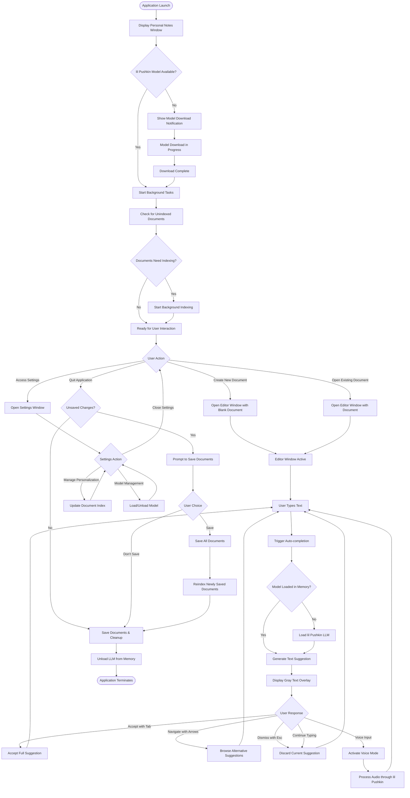
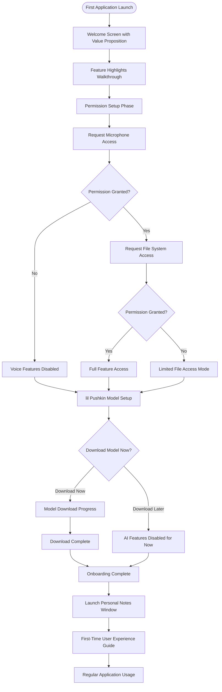
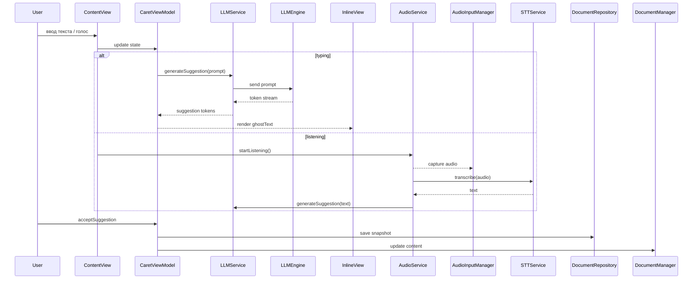

# Killah Application Technical Specification

**Last Updated:** June 3, 2025

*This document provides technical specifications for the Killah writing application, structured for engineering implementation using Swift, SwiftUI, and AppKit. Sections are organized by software architecture components and implementation requirements.*

## 1. Project Overview

### 1.1. Project Name

Killah

### 1.2. Target Audience

Anyone who writes, including students, bloggers, and fiction writers. Initially less suited for technical writers due to a focus on creative inspiration rather than rigid templates, though it can follow templates if provided.

### 1.3. Core Problem Addressed

Current language models often lack diversity in their writing, producing text that is easily identifiable as AI-generated ("AI slop"). Additionally, many LLMs aim to substitute human writers rather than assist them.

### 1.4. Unique Selling Proposition

Killah aims to:

* Assist writers with their own ideas, helping them continue and formulate their thoughts into final texts.
* Focus on augmenting the writer's creativity, not replacing it.
* Natively support macOS (developed in Swift with SwiftUI and AppKit) and operate locally, ensuring privacy and offline access.
* Be available as a one-time payment application, without subscriptions.

### 1.5. Timeline & Milestones

* **Project Duration:** June 5, 2025 - July 17, 2025 (6-week development cycle)

#### Milestone 1 (June 5-8): Foundation & Core Architecture

* Set up Xcode project with Swift/SwiftUI/AppKit
* Implement basic text editor with NSTextView
* Create main window structure and basic UI layout
* Set up basic toolbar with formatting controls (bold, italic, underline, alignment)

#### Milestone 2 (June 9-15): Text Processing & Caret System

* Implement intelligent caret system with visual feedback
* Add basic text selection and manipulation
* Implement autocompletion trigger system with caching mechanism
* Create token-based input processing for efficient LLM queries

#### Milestone 3 (June 16-22): LLM Integration & Model Management

* Integrate "lil Pushkin" LLM with Swift inference
* Implement model download and loading system
* Add text generation and streaming output functionality
* Create suggestion navigation (left/right arrows for alternatives)

#### Milestone 4 (June 23-29): Voice Input & Audio Processing

* Implement audio capture and real-time visualization
* Add streaming STT for live transcription preview
* Integrate voice input with "lil Pushkin" LLM for dictation/commands
* Implement audio visualization in caret area

#### Milestone 5 (June 30-July 6): Document Management & Personalization

* Create Personal Notes View with document listing
* Implement personalization system with document indexing
* Add settings window with personalization management
* Implement file operations (save, load, export formats)

#### Milestone 6 (July 7-17): Polish, Error Handling & Final Integration

* Implement comprehensive error handling and notification system
* Add version history for text selections (up/down navigation)
* Performance optimization and testing
* Final UI polish and bug fixes

### 1.6. Resource Constraints

* **Resources:** Occasional access to an NVIDIA A100 GPU for several days for model training. Development primarily on Apple M1 Max.

## 2. Application Design & User Experience

### 2.1. Core Principles

* **Minimalist & Archaic Aesthetic:** A clean, modern, distraction-free writing environment with subtle design cues (e.g., typography, color palettes like warmer browns or cooler blues) that evoke a classic, focused writing experience. The UI will be highly responsive with fluid animations for all interactions.
* **Intelligent Caret-Centric Interaction:** The text caret is the primary point of interaction, not just for text input, but for voice commands and LLM assistance.
* **Local-First & Private:** All user data, processing, and personalization remain on the user's machine.

### 2.2. Application Windows Structure

#### 2.2.1. Personal Notes Window (Launch Window)

Documents are displayed in chronological order by modification time (most recent first) and organized into two distinct sections:

* **Personalized Documents:** Files that have been indexed for personalization, always displayed at the top
* **Non-Personalized Documents:** All other documents in a separate section below
* **Display:** Each document preview includes file name, extension, last modified date, and content snippet
* **Create New Note:** Prominent "+" button for creating new documents

#### 2.2.2. Editor Window (Main Writing Interface)

**Text Editor Components:**

* **NSTextView-based editor** with rich text support
* **Toolbar:** Standard AppKit formatting controls including:
  * Bold, italic, underline, strikethrough
  * Text alignment (left, center, right, justify)
  * Font selection and sizing
  * Text color and highlighting
  * Bulleted and numbered lists
  * Insert link/image functionality

**Intelligent Text Caret:**

* **Functionality:** Central hub for text input, voice input, and LLM interaction
* **Visual Behavior:** Dynamic appearance changes based on current task (listening, generating, suggesting)
* **Audio Visualization:** Real-time wave visualizations during microphone input
* **Live Transcription Preview:** Streaming STT preview near caret, with full processing by "lil Pushkin" LLM
* **Controls:** Integrated pause/stop controls for voice input
* **Prompt Interface:** Floating prompt input field appears adjacent to caret for LLM queries
* **Answer Windows:** LLM responses display in overlay windows with iOS-style notification stacking
* **History Management:** Previous prompt-answer pairs stack vertically, newest on top, with swipe-to-dismiss gestures

**Text Generation & Display:**

* **Streaming Output:** Token-by-token LLM suggestions with visual effects
* **Dynamic Appearance:** Generated text displays with gradient effects using Metal shaders
* **Suggestion Animation:** Suggestions appear with smooth fade-in and disappear with left-to-right truncation animation

**LLM Interaction Modes:**

*Auto-completion Mode (Sentence Continuation):*

* Triggered automatically on text input/modification
* Navigation: Left/Right arrow keys for diverse alternatives
* Acceptance: Tab (full suggestion), Ctrl+Right (word-by-word)
* Rejection: Esc key to dismiss current suggestion
* Smart caching for rapid text modifications

*Text Selection Mode (Rewriting/Editing):*

* Voice/text prompts for selected text modifications
* "lil Pushkin" LLM provides change explanations
* Navigation: Up/Down arrows for version history
* Complete edit history preservation for re-selected text spans
* **Persistent Edit Memory:** When user re-selects the same text portion, all previous prompts and LLM responses reappear in chronological order
* **Response Preservation:** Both user prompts and LLM answers are stored and retrieved together

*Voice Integration:*

* Voice commands for text modifications
* Voice dictation for composition from caret position

* Voice commands for text modifications
* Voice dictation for composition from caret position

**Version History & Edit Management:**

* Snapshots created for significant edits/LLM generations
* Stored in `.killah` format using SwiftData
* Version navigation via trackpad swipes or arrow keys
* **Complete Interaction History:** Associated prompts AND LLM responses preserved together
* **Context-Aware Retrieval:** Re-selecting same text span restores full prompt-response history
* **Chronological Display:** Previous interactions appear in iOS-style stacked interface

#### 2.2.3. Settings Window

**Window Structure:** Single settings window accessible via Killah > Settings (Cmd+,)

**Appearance Settings:**
* Automatic theming toggle (sync with macOS Light/Dark) (post-MVP)
* Manual theme selection (Classic Brown, Modern Blue with light/dark variants) (post-MVP)

**Language Settings:**
* UI language dropdown (English, Russian) (post-MVP)

**Model Management ("lil Pushkin" LLM):**
* Load/Unload model controls
* Resource indicators (memory usage, processing power) (post-MVP)

**Personalization Management:**
* **Document List:** Scrollable list of all known documents
* **Per-Document Controls:**
  * "Index for Personalization" / "Remove from Personalization Index" buttons
  * Visual feedback during indexing (progress indicators)
  * Re-indexing controls for modified documents
* **Global Settings:**
  * Automatic personalization toggle
  * Folder selection for document scanning
  * Manual "Start Indexing" / "Re-index All" buttons

**Application Shortcuts:**
* Non-interactive reference section for keyboard shortcuts

**Developer Contact:**
* Support email and feedback contact information

## 3. Core Functionality

### 3.1. Auto-completion & Text Processing

**Trigger System:**
* Activated on every text input/modification (typing, deletion, mid-text edits)
* Handles rapid text changes through intelligent caching mechanism

**Caching & Performance Optimization:**

* **Prompt Cache:** Maintains tokenized representations of text context
* **Incremental Tokenization:** When new characters are added:
  * Re-tokenize modified text from current position
  * Compare new tokens with cached tokens from right to left
  * Find divergence point (maximum 5 symbols from prompt end)
  * Recompute only the divergent portion of the prompt cache
  * Preserve unchanged token cache to avoid full reprocessing
* **Incremental Updates:** Only processes changed portions rather than full text corpus
* **Cache Invalidation:** Smart invalidation based on context changes and edit distance
* **Memory Management:** Automatic cache cleanup for old document versions

**Suggestion Behavior:**

* **Continuous Display:** Gray text overlay shows current suggestion
* **Adaptive Persistence:** Suggestion remains active when user types matching text
* **Error Tolerance:** Brief mistyping followed by quick correction maintains suggestion state
* **Suggestion Acceptance:**
  * Tab: Accept full suggestion
  * Ctrl+Right: Accept word-by-word
  * Esc: Dismiss current suggestion
  * Continue typing: Discards suggestion (only Tab/Ctrl+Right accept suggestions)

### 3.2. Text Editing & Formatting

* **Basic Operations:** Standard text input, select, cut, copy, paste, undo/redo.
* **Formatting Tools (Rich Text Context):**
  * Bold, italics, underline, strikethrough.
  * Numbered and bulleted lists.
  * Text alignment.
  * Text highlighting.
  * Font selection and size adjustment.
  * *Note:* Formatting is applied to an attributed string in Swift.
* **Keyboard Shortcuts:** Full support for standard macOS text editing shortcuts.

### 3.3. Import & Export

* **Supported Formats:**
  * `.txt` (Plain Text): Exports by extracting plain text from the attributed string. Imports as plain text.
  * `.rtf` (Rich Text Format): Exports the attributed string with its formatting. Imports RTF (requires a robust RTF parser/writer, e.g., using `NSAttributedString` capabilities).
  * `.md` (Markdown): Exports by converting the attributed string's formatting to Markdown syntax. Imports Markdown, converting it to an attributed string. (Requires a Markdown parser/generator library, e.g., Ink).
  * `.pdf` (Portable Document Format): Exports by embedding the text (potentially with basic formatting) into a PDF. (Requires PDF generation capabilities, e.g., Core Graphics/PDFKit in Swift. `PDFDocument` from PDFKit can be used).
  * `.docx` (Word Document): Exports as a Word document. Imports Word documents. (This is complex. For export, a basic approach might generate a compatible format like .rtf that Word can open, or use a third-party library. Direct .docx generation/parsing in Swift without external dependencies is challenging. Consider `CocoaPods` or `Swift Package Manager` for libraries like `SwiftDocX` if available and suitable, or investigate if `NSAttributedString` has any built-in docx export/import capabilities, though this is unlikely for full fidelity).
* **Default Save Format:** `.killah` if advanced versioning is implemented; otherwise, `.md` or `.txt` are preferred for simplicity in MVP.

### 3.4. Error Handling & Notifications System

**Notification Framework:**
* **Persistent Notifications:** Model download progress (cannot be dismissed until complete)
* **Dismissible Notifications:** General errors, info messages (auto-dismiss after 5 seconds or user click)
* **Stacking Behavior:** New notifications appear on top, older ones slide down

**Error Categories & Handling:**

**Swift Runtime Errors:**
* Automatic error capture with NSError/Error protocols
* Stack trace collection for debugging
* Automatic email composition with error details and system information
* User consent before sending diagnostic data

**Model-Related Errors:**
* Model loading failures with recovery suggestions
* Memory allocation errors with resource management tips
* Inference timeouts with retry mechanisms

**File System Errors:**
* Document save/load failures with alternative save locations
* Permission errors with clear resolution steps
* Storage space warnings with cleanup suggestions

**Audio Processing Errors:**
* Microphone access denials with permission guidance
* Audio hardware failures with fallback options
* Processing timeouts with quality adjustment suggestions

**Network Errors (Model Download):**
* Connection failures with retry mechanisms
* Download interruption with resume capability
* Server errors with alternative download sources

**Notification Implementation (AppKit):**
* Custom NSView-based notification system
* Integration with NSUserNotification for system-level alerts
* Smooth animation transitions using Core Animation
* Thread-safe notification queue management

## 4. System Design & Application Lifecycle

This section outlines the overall system architecture, application flow, and key operational processes.

### 4.1. Application Lifecycle

**Key Lifecycle Components:**

**Document Re-indexing System:**

* **File Monitoring:** Watch designated personalization folders for modifications
* **Automatic Re-indexing:** Trigger re-indexing when personalized documents are modified
* **Manual Controls:** Settings window provides "Re-index" buttons for individual documents
* **Background Processing:** Non-blocking re-indexing to maintain UI responsiveness

### 4.2. Audio Data Handling

* **4.3.1. Processing Flow:**
  1. Raw audio is captured from the microphone.
  2. The small, local streaming STT model processes chunks of audio for live preview near the caret (UX only).
  3. Simultaneously, the audio stream (or relevant segments) is fed to "lil Pushkin" LLM's audio encoder (Conformer).
  4. The Conformer generates audio embeddings.
  5. These embeddings are projected and passed to the Gemma 3B text LLM, along with text context, for interpretation (dictation or command).
  6. The LLM generates text output or performs an action.

* **4.3.2. Storage Considerations for Audio Data:**
  * **Temporary File Storage During Active Processing:**
    * **Description:** Audio chunks might be temporarily written to a secure, app-specific cache directory during active voice input, especially for longer dictations. These files would be deleted immediately after successful processing or when the voice input session ends.
    * **Pros:** Might offer more robust handling for very long audio inputs before they are fed to the model.
    * **Cons:** Adds complexity for managing temporary files securely, slight disk I/O.

  * **Later: Persistent Storage Linked to Versions (Advanced - Post-MVP, if `.killah` versioning is implemented):**
    * **Description:** If the `.killah` file format with version history is implemented, short audio snippets corresponding to specific voice inputs could be stored within the `.killah` file, linked to the text version they generated or the command they invoked.
    * **Pros:** Allows users to replay the audio associated with a particular piece of text or command, potentially useful for context or re-processing.
    * **Cons:** Significantly increases file size, adds complexity to data management within the `.killah` file, requires careful consideration of user consent for storing voice data persistently.
    * **Database/Format:** If this path is chosen, audio snippets could be stored as raw audio files (e.g., `.wav`, `.opus` for compression) within the SwiftData-managed `.killah` package, or their binary data directly in SwiftData if appropriate.

* **4.3.3. Audio Format (for temporary or persistent storage if used):**
  * If temporary/persistent storage is used, a common, efficient format like `.opus` (compressed, good quality) or uncompressed `.wav` (higher quality, larger size) could be considered. The choice depends on the trade-off between quality, disk space, and processing overhead.

### 4.3. Audio-Text Mapping System *(Post-MVP - Critical Analysis)*

**Proposed Feature Description:**

When recording audio to compose text (either from selected area or from scratch), the generated text would include a visual interface showing a horizontally split view:

* **Top Half:** Generated text content
* **Bottom Half:** Audio waveform corresponding to the text above

The interface would provide:

* **Cursor Control:** Voice Memos-style cursor that transforms into audio editor scrubbing controls
* **Synchronization:** Each text segment visually maps to corresponding audio waveform portions
* **Navigation:** Click and drag through audio timeline to see text highlighting
* **Instruction Handling:** Audio instructions like "create the intro" map to the entire generated intro section
* **Visual Differentiation:** Instruction waveforms display in one color, transcribed content in another

**Critical Analysis:**

**Complexity vs. Value Assessment:**

The proposed audio-text mapping with unified processing architecture represents a sophisticated approach that addresses key technical challenges:

**Technical Solutions:**

* **Waveform Rendering:** Pre-generated once during processing, not real-time
* **Storage Overhead:** Acceptable for valuable audio-text correlation functionality
* **Dynamic Mapping:** One-time alignment during processing, not real-time synchronization
* **Instruction Detection:** Fine-tuned "lil Pushkin" LLM handles instruction vs. content classification
* **Timestamp Alignment:** Eliminated through sequence matching—only requires instruction/content markers

**Recommendation for Post-MVP Implementation:**

The unified processing approach makes this feature technically viable and valuable:

* **Post-MVP Priority:** High value for users working with long-form audio content
* **Implementation Phases:**
  * Phase 1: Basic sequence matching and instruction detection
  * Phase 2: Audio waveform visualization with color coding
  * Phase 3: Full scrubbing interface and timeline navigation

The sequence matching approach addresses fundamental technical challenges and provides genuine value for preserving user intent during extended audio sessions.

**If Implemented (Advanced Technical Approach):**

**Unified Processing Architecture:**

* **Real-time Transcription Flow:**
  * Lightweight STT model provides live transcription during recording
  * Words appear in interface as spoken, then fade (current UI behavior)
  * **Key Change:** Transcribed words + audio chunks saved to file instead of discarded
  
* **Post-Recording Processing:**
  * Stop recording triggers "lil Pushkin" LLM processing
  * LLM receives: original audio transcription + audio file
  * **LLM generates two outputs:**
    * Final polished text (instructions executed, content refined)
    * **Instruction/Content mapping:** LLM marks which parts were instructions vs. dictated content
  
* **Audio-Text Alignment:**
  * Use sequence matching between:
    * Original transcription chunks ↔ Final LLM text segments
  * LLM-provided instruction/content markers create natural breakpoints
  * Audio chunks map to text segments through transcription alignment

### 4.4. Model Distribution & Updates

* **4.4.1. Initial Model Download:**
  * **Protocol:** HTTPS is the standard and recommended protocol for downloading model weights. This ensures data integrity and security during transit.
  * **Source:** Model files would be hosted on a secure server (e.g., AWS S3, Google Cloud Storage, or a dedicated hosting solution).
  * The application would download the files to the designated local directory.

* **4.4.2. Model Storage Location:**
  * A standard macOS location for application support files, e.g., `~/Library/Application Support/Killah/Models/`.
  * This keeps the model separate from the application bundle, allowing it to persist across app updates and be managed independently.
  * **Model Folder Protection:** Protecting this folder from direct user access to prevent unauthorized copying of model weights is challenging on a user-owned machine. Standard file permissions in `~/Library/Application Support/` make it non-obvious for average users to find or modify. App Sandboxing (if Killah is sandboxed) can further restrict how other processes interact with the app's data. However, a technically savvy user with admin privileges can generally access any part of their file system. Truly robust protection against determined users often requires more complex DRM (Digital Rights Management) solutions, which are beyond the scope of this project. For the MVP, the obscurity of the Application Support folder and standard file permissions will be the primary means of discouraging casual access.

* **4.4.3. Update Mechanism (Conceptual):**
  * The app could check a version file on the server at each launch.
  * If a new model version (base or LoRA adapters) is available, prompt the user to download the update, similar to the initial download process.

### 4.5. Application Protection & Licensing *(Post-MVP)*

**Overview:** Comprehensive licensing and security features will be implemented after core functionality is proven viable.

**Trial System:**

* 3-day trial period stored in macOS Keychain
* Trial-expired modal after expiration
* License key entry for full activation

**Server-Side Validation:**

* HTTPS license verification against remote server
* Unique license keys generated per purchase
* Basic anti-tamping through code signing and Hardened Runtime

**Implementation Stack:**

* **Backend:** FastAPI/Express.js with PostgreSQL
* **Security:** HTTPS, rate limiting, secure key storage
* **Payment:** Integration with Stripe/Paddle for license generation

*Note: Focus on core application functionality first. This comprehensive licensing system will be developed after the MVP proves market viability.*

## 5. Post-MVP Feature: First-Time User Onboarding

*This comprehensive onboarding system introduces new users to Killah's features while handling permissions and initial setup. Implemented as a post-MVP feature to ensure core functionality is stable before adding guided experiences.*

**Onboarding Flow Components:**

* **Welcome Screen:** Clean introduction with core value proposition
* **Feature Demonstrations:** 3-4 key features with subtle animations

* **Permission Requests:** Microphone, file system access with clear explanations

* **Model Download:** Optional "lil Pushkin" download with progress tracking
* **Graceful Degradation:** App remains functional if permissions denied

**Onboarding Flow Diagram:**

*Note: This comprehensive onboarding system will be implemented post-MVP to focus initial development on core writing functionality.*

## 6. Архитектурные паттерны и системный дизайн

Этот раздел описывает ключевые шаблоны проектирования и слоистую архитектуру приложения.

### 6.1. Слои приложения

1. Presentation (UI)
   * SwiftUI Views (`ContentView`, `IntelligentCaretView`, `PersonalNotesWindow`, `SettingsWindow`)
   * NSViewRepresentable (`InlineSuggestingTextView`) + Coordinator для AppKit-части
2. Domain (Business Logic)
   * MVVM: `CaretViewModel`, `DocumentManager`, `PersonalizationManager`
   * Models: `Document`, `EditSnapshot`, `TextSegment`
3. Data (Persistence & Services)
   * Persistence:
     * Repository Pattern: `DocumentRepository` (save/load `.killah`, `.md`, `.txt`)
     * SwiftData (`PersistenceController`, `DocumentEntity`, `EditSnapshotEntity`)
   * Services:
     * `LLMService` (Adapter для `LLMEngine` → Python process)
     * `AudioService` (Adapter для `AudioInputManager` + `STTService`)

### 6.2. Основные шаблоны проектирования

* MVVM (Model-View-ViewModel)
  * `View` подписывается на `@Published` свойства ViewModel
  * ViewModel управляет состоянием каретки, списком документов, историей версий
* Coordinator / Delegate
  * `Coordinator` в `NSViewRepresentable` обрабатывает делегирование событий NSTextView
  * `WindowManager` координирует открытие/закрытие окон
* Repository
  * `DocumentRepository` инкапсулирует CRUD-логику для файлов и SwiftData
* Service / Adapter
  * `LLMService` адаптирует `LLMEngine` под асинхронный Swift API
  * `STTService` и `AudioInputManager` инкапсулируют логику захвата и транскрипции аудио
* Command / Strategy
  * `AcceptSuggestionCommand`, `RejectSuggestionCommand` для обработки пользовательских действий
  * Стратегия выборa STT-движка (Apple Speech vs. локальная модель)
* Dependency Injection
  * Передача сервисов через `EnvironmentObject` и `@ObservedObject`

### 6.3. Интеракция компонентов (Sequence Diagram)

### 6.4. Рекомендации по расширению

* Разделить `LLMService` и `PythonAdapter` (Bridge pattern) для поддержки нескольких backends
* Внедрить Unit Tests для ViewModel, Repository и Service слоёв
* Использовать Combine для реактивных цепочек обработки и отмены запросов
