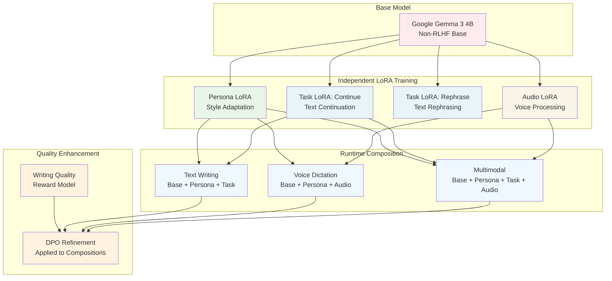
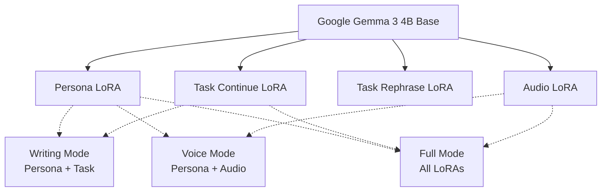

# Killah Language Model Implementation Guide

**Last Updated:** June 4, 2025

## 1. Project Overview

### 1.1. Project Name

lil Pushkin

### 1.2. Core Goal

Develop a persona-conditioned language model for writing assistance through deep personalization. The model uses the Google Gemma 3 4B base model, which has not undergone extensive Reinforcement Learning from Human Feedback (RLHF). This choice aims to preserve the model's raw stylistic capabilities, making it adaptable for genuine personalization and less prone to generic outputs sometimes associated with heavily aligned models. By using a non-RLHF base model, "lil Pushkin" seeks to maintain flexibility and creativity for tasks like story generation, rephrasing, and continuation.

The system incorporates native multimodal capabilities, seamlessly handling both text and audio input through a unified persona-conditioned architecture. Users can dictate content, issue voice commands, and receive audio feedback, all while maintaining their personal writing style and voice characteristics. The audio processing is deeply integrated with the text understanding, allowing for natural transitions between typing and speaking during the writing process.

All capabilities are built upon this base using a LoRA-centric approach, starting with a foundational PersonaPlugs conditioning layer, upon which all task-specific LoRA adapters are built. This ensures every capability inherently reflects the user's writing style and voice.

### 1.3. Architecture Principles

The architecture of "lil Pushkin" is built around **LoRA Composition** - a modular approach where independent LoRA adapters can be dynamically combined to create different capabilities. This is fundamentally different from traditional fine-tuning approaches.

We start with a **Clean Base Model** using Google Gemma 3 4B that hasn't undergone extensive RLHF (Reinforcement Learning from Human Feedback). Most commercial models are heavily fine-tuned to be "safe" and "helpful," which often makes them sound generic and corporate. By starting with a less processed model, we maintain the raw stylistic capabilities that make genuine personalization possible.

Our **Modular LoRA Architecture** consists of three independent, composable adapters:

**Persona LoRA** is trained directly on the base model to learn stylistic adaptation using the PersonaPlugs methodology. This adapter focuses purely on capturing and reproducing writing style patterns without any task-specific behavior.

**Task-Specific LoRAs** are trained independently on the base model for specific writing tasks (continuation, rephrasing, summarization). Each task LoRA learns its specific capability without style considerations - the style comes from the Persona LoRA when they're composed.

**Audio LoRA** handles multimodal input processing, converting audio embeddings into text space and managing voice commands. It's trained independently to handle audio-to-text projection and command recognition.

**Dynamic Composition at Runtime** follows a consistent pattern where personalization and audio capabilities are always available in interactive scenarios:

- **Pure autocomplete only:** `Base + Task` (minimal composition for maximum speed)
- **Text writing/rewriting:** `Base + Persona + Audio + Task` (personalized style with voice capability)
- **Voice dictation:** `Base + Persona + Audio + Task` (full multimodal with personalization)
- **Interactive editing:** `Base + Persona + Audio + Task` (personalized assistance with voice feedback)

This architecture ensures that **Persona LoRA (personalization) and Audio LoRA are the default for all meaningful user interactions**, providing consistent personalized experience and voice integration. Only pure autocomplete operates without them for optimal typing performance.

Finally, **DPO Refinement** can be applied to individual LoRA adapters or their compositions using Direct Preference Optimization with our custom reward model. This approach maintains the modularity while improving quality.

### 1.4. Implementation Timeline

**Duration:** Adjusted for rapid development (target ~2-3 weeks intensive work)

#### Week 1: Parallel Independent LoRA Training

The first week focuses on training three independent LoRA adapters in parallel, since they don't depend on each other in the new modular architecture.

**Persona LoRA Training (Days 1-3):**
We begin with environment setup and acquiring the Gemma 3 4B base model. Days 1-2 focus on preparing high-quality author corpora from Project Gutenberg and other sources, ensuring diverse writing styles in English and Russian. Day 3 involves training the Persona LoRA using rank 64 and alpha 128 parameters.

**Task-Specific LoRA Training (Days 2-5):**
Starting Day 2, we prepare task-specific datasets (WikiText-103 for continuation, OpenAssistant for rephrasing) and train separate LoRAs for each task directly on the base model. These training sessions can run in parallel since they're independent.

**Audio LoRA Training (Days 4-6):**
Audio processing setup begins Day 4, preparing multimodal datasets from LibriSpeech, Common Voice, and Russian audio corpora. The Audio LoRA trains independently on the base model to handle audio-to-text projection and command recognition.

**Target Outcomes:** Three independent LoRAs - `Persona_LoRA`, `Task_Continue_LoRA`, `Task_Rephrase_LoRA`, and `Audio_LoRA`
**GPU Requirements:** 60-90 A100 GPU hours total (can run in parallel on multiple GPUs)

#### Week 2: Composition Testing & DPO Refinement

Week 2 focuses on testing LoRA compositions and refining them with DPO.

**Composition Validation (Days 1-2):**
We test different combinations of LoRAs to validate that they compose correctly:

- `Base + Persona + Task_Continue` for styled text continuation
- `Base + Persona + Audio` for voice-aware personalized responses  
- `Base + Audio + Task_Continue` for voice-commanded writing
- `Base + Persona + Task_Continue + Audio` for full multimodal capability

**WQRM Development (Days 2-4):**
Implement and validate our Writing Quality Reward Model using edit preference pairs and quality gradient examples.

**DPO Refinement (Days 4-7):**
Apply Direct Preference Optimization to key LoRA combinations, focusing on the most important compositions like `Persona + Task` combinations.

**Target Outcomes:** Validated LoRA compositions with DPO refinement
**GPU Requirements:** 30-50 A100 GPU hours for DPO training

#### Week 3: PersonaPlugs Runtime & Deployment

Week 3 implements the runtime system and prepares for deployment.

**PersonaPlugs Runtime (Days 1-4):**
Implement dynamic LoRA loading and composition system, document indexing for persona vector generation, and real-time LoRA switching based on user context.

**Optimization & Deployment (Days 5-7):**
Quantization (INT4) for deployment efficiency, ExecuTorch preparation, integration testing of all components, and comprehensive documentation.

**Final Deliverable:** Complete modular LLM system with dynamic LoRA composition capabilities

**Revised Total Estimated A100 GPU Hours:** Approximately 90-140 hours (can be parallelized across multiple GPUs for faster completion)

#### Critical Path Dependencies (Simplified)

- All LoRA training can happen in parallel (Week 1)
- WQRM development needed before DPO (Week 2)  
- PersonaPlugs runtime development can happen in parallel with DPO (Week 2-3)
- No sequential dependencies between LoRA adapters

### 1.5. Resource Requirements

Our development setup centers around the Apple M1 Max for primary development and local testing, providing the computational power needed for model inference and initial validation. When it comes to serious training, we'll rely on NVIDIA A100 GPU access for focused training bursts, as estimated in our timeline.

The foundation of our system is the Google Gemma 3 4B model, specifically chosen because it hasn't undergone extensive RLHF processing. This gives us the raw stylistic capabilities we need for genuine personalization.

Our core techniques include LoRA for all adaptations, Direct Preference Optimization for quality refinement, quantization for deployment efficiency, and ExecuTorch for final deployment to ensure optimal performance on target hardware.

## 2. PersonaPlugs-Conditioned Architecture

### 2.1. Foundational Principle: LoRA-based Personalization and Adaptation

The entire "lil Pushkin" architecture is built upon the principle of using Low-Rank Adaptation (LoRA) for all model fine-tuning and specialization. The Google Gemma 3 4B base model's weights remain frozen. Personalization and new capabilities are introduced by training a series of LoRA layers.

This process begins with the creation of a **Foundational Persona LoRA**. This initial LoRA is trained on diverse, high-quality author corpora to imbue the base model with the ability to adapt to various writing styles. It serves as the common ancestor for all subsequent LoRAs, ensuring that stylistic understanding is a core component from the outset. At runtime, this LoRA (and its derivatives) will be conditioned by dynamically generated persona vectors from user documents (see Section 2.4: PersonaPlugs: Runtime Personalization Details) to achieve specific user personalization.

### 2.2. Persona-Conditioned Multimodal Architecture

**Text Processing Stack:**

The text processing architecture builds in layers, starting with the Google Gemma 3 4B base model that serves as our non-RLHF foundation. On top of this sits our core `Persona_Audio_LoRA`, which evolved from the `Foundational_Persona_LoRA` and gained audio capabilities during training.

From this foundation emerge our specialized LoRAs—clones of the `Persona_Audio_LoRA` that have been fine-tuned and refined through DPO for specific tasks like `LoRA_Continue_DPO` and `LoRA_Rephrase_DPO`. Each specialized LoRA maintains the persona conditioning while excelling at its particular writing task.

Direct Preference Optimization integration runs throughout this process, ensuring that each specialized LoRA learns to prefer high-quality outputs while maintaining the user's personal style.

**Audio Processing Stack:**

Audio processing begins with a pre-trained Conformer model that handles raw audio input, converting acoustic signals into audio embeddings: $[\vec{a}_1, \vec{a}_2, ..., \vec{a}_N]$ where each $\vec{a}_i \in \mathbb{R}^{d_{audio}}$.

These audio embeddings then pass through a projection layer—an MLP that bridges the audio space to our persona-conditioned text space, transforming each $\vec{a}_i$ into $\vec{e}_i \in \mathbb{R}^{d_{LLM}}$ that the language model can understand.

The key innovation here is persona integration throughout the audio understanding process. Rather than treating audio as a separate modality, our `Persona_Audio_LoRA` ensures that audio understanding is conditioned on the user's communication patterns and voice characteristics from the ground up.

**Unified Input Processing (at inference with a DPO-refined specialized LoRA):**

Our system handles both text and audio input through a unified approach that always includes persona conditioning. For text input, we combine the PersonaVector with TextEmbedding and ContextEmbedding: `[PersonaVector; TextEmbedding; ContextEmbedding]`. Audio input follows the same pattern but uses ProjectedAudioEmbedding: `[PersonaVector; ProjectedAudioEmbedding; ContextEmbedding]`.

Command detection represents a sophisticated capability where the system disambiguates between dictation and commands based on user patterns. This persona-aware disambiguation leverages the `Persona_Audio_LoRA`'s deep understanding of how each user typically interacts with the system, distinguishing between "write this down" versus "delete that paragraph" based on context and personal usage patterns.

### 2.3. Modular LoRA Training Pipeline and Strategy

The training strategy for "lil Pushkin" follows a **modular, independent LoRA approach**. Instead of sequential training where one LoRA builds upon another, we train separate LoRAs for different capabilities and then **compose them dynamically at runtime**. This eliminates catastrophic forgetting and provides maximum flexibility.

**Core Principle:** The Gemma 3 4B base model weights remain frozen. All capabilities are achieved through independent LoRA adapters that can be combined in different configurations. Each LoRA is trained directly on the base model, learning its specific capability without interference from other tasks.

**LoRA Composition at Runtime:**
```python
# Dynamic LoRA loading and composition
base_model = AutoModelForCausalLM.from_pretrained("google/gemma-3-4b")

# Standard interactive compositions (Persona + Audio + Task):
writing_model = PeftModel.from_pretrained(base_model, "persona_lora/")
writing_model = PeftModel.from_pretrained(writing_model, "audio_lora/")  # Always present
writing_model = PeftModel.from_pretrained(writing_model, "task_continue_lora/")

voice_model = PeftModel.from_pretrained(base_model, "persona_lora/") 
voice_model = PeftModel.from_pretrained(voice_model, "audio_lora/")
voice_model = PeftModel.from_pretrained(voice_model, "task_dictation_lora/")

# Pure autocomplete only (minimal composition for speed):
autocomplete_model = PeftModel.from_pretrained(base_model, "task_autocomplete_lora/")
```

**Core Architecture Principle:** In all interactive scenarios, **Persona LoRA and Audio LoRA are always present** to ensure consistent personalization and voice capabilities. Only pure autocomplete operates with minimal composition for optimal typing performance.

**Runtime Personalization with PersonaPlugs:**
The PersonaPlugs methodology (detailed in Section 2.4) provides dynamic, user-specific conditioning at inference time. User documents are processed to create persona vectors, which are then used to condition whichever LoRA composition is active.



**Pipeline Stages:**

#### 2.3.1. Stage 1: Independent LoRA Training (Parallel Execution)

**Persona LoRA Training (Pure Style Adaptation)**

- **Goal:** Create a LoRA that adapts the base Gemma 3 4B model to diverse writing styles, focusing purely on stylistic patterns without task-specific behavior.
- **Base:** Google Gemma 3 4B (frozen weights)
- **Data:** High-quality, stylistically diverse author corpora from Project Gutenberg and other sources, ensuring English and Russian representation. Focus on tens of thousands of examples showcasing different writing styles.
- **Process:** Train using rank 64 and alpha 128 parameters, focusing on style transfer without any task conditioning.
- **Outcome:** `Persona_LoRA` - a pure style adaptation layer
- **Estimated GPU Hours:** 20-30 A100 GPU hours

**Task-Specific LoRA Training (Independent Task Learning)**

- **Goal:** Create specialized LoRAs for individual writing tasks, each trained independently on the base model.
- **Base:** Google Gemma 3 4B (frozen weights) - NO other LoRAs loaded
- **Data:** Task-specific datasets ensuring EN/RU examples:
  - **Continue:** WikiText-103 subsets, Project Gutenberg continuations
  - **Rephrase:** OpenAssistant subsets, Dolly 15k, synthetic rephrasing pairs
- **Process:** Train each task LoRA independently using rank 64 and alpha 128 parameters. Each LoRA learns pure task capability without style considerations.
- **Outcome:** Independent task LoRAs (`Task_Continue_LoRA`, `Task_Rephrase_LoRA`)
- **Estimated GPU Hours:** 20-30 A100 GPU hours per task LoRA

**Audio LoRA Training (Independent Audio Processing)**

- **Goal:** Create an audio processing LoRA that handles voice input and audio-to-text projection independently.
- **Base:** Google Gemma 3 4B (frozen weights) - NO other LoRAs loaded
- **Data:** Multimodal audio-text datasets with EN/RU content from LibriSpeech, Common Voice, Open STT, Russian audio corpora
- **Process:** Train audio processing capabilities using rank 64 and alpha 128 parameters, focusing on audio understanding without style or task considerations.
- **Outcome:** `Audio_LoRA` - pure audio processing capability
- **Estimated GPU Hours:** 25-35 A100 GPU hours

#### 2.3.2. Stage 2: Persona-Audio LoRA Training (Audio Integration)

* **Goal:** Augment the `Foundational_Persona_LoRA` with audio processing capabilities for EN/RU voice commands and dictation.

* **Base:** Gemma 3 4B + `Foundational_Persona_LoRA`.
* **Data:** Multimodal audio-text datasets with EN/RU content. Prioritize high-quality subsets from sources like LibriSpeech (EN), Common Voice (multilingual, check RU availability/quality), VoxPopuli (multilingual), Open STT (RU), Russian Scripted Monologue Dataset (RU), People’s Speech (multilingual). Focus on curated subsets (e.g., tens of thousands of utterances) rather than full dataset sizes. These are typically available via their project websites or Hugging Face Datasets.
* **Process:**
  Integration involves setting up the audio processing stack, then continuing to train the LoRA with rank 64 and alpha 128 parameters using the audio data to create our multimodal capabilities.
* **Outcome:** `Audio_Persona_LoRA`.
* **Estimated GPU Hours:** Additional 20-40 A100 GPU hours.

#### 2.3.3. Stage 3: Task-Specific LoRA Specialization (Cloning and Fine-tuning)

* **Goal:** Create specialized LoRAs for a *prioritized set* of 1-2 writing assistance tasks (e.g., Continue, Rephrase), building upon the `Audio_Persona_LoRA`.

* **Base:** Gemma 3 4B + `Audio_Persona_LoRA`.
* **Data:** Task-specific datasets, ensuring EN/RU examples where possible.
  * **Continue:** Subsets of WikiText-103 (EN), curated continuations from Project Gutenberg (EN/RU).
  * **Rephrase:** Subsets of OpenAssistant (multilingual, check RU), Dolly 15k (EN). Consider generating synthetic rephrasing pairs from EN/RU texts if needed.
  * **Story Generation (if prioritized):** Subsets of ROCStories (EN), WritingPrompts (EN). Look for or create EN/RU story datasets if this is a priority.
  * *Focus on smaller, high-quality datasets (e.g., 10k-50k examples per task for LoRA fine-tuning).*
* **Process:**
  Task specialization begins by cloning the `Audio_Persona_LoRA` for each prioritized task. We then fine-tune each cloned LoRA using rank 64 and alpha 128 parameters on its specific task dataset. Throughout this process, we monitor for intruder dimension issues, though this is less likely with our smaller LoRA datasets.
* **Outcome:** Specialized LoRAs for chosen tasks (e.g., `LoRA_Continue_Specialized`, `LoRA_Rephrase_Specialized`).
* **Estimated GPU Hours:** 15-25 A100 GPU hours per LoRA. (e.g., 30-50 hours for two LoRAs).

#### 2.3.4. Stage 4: DPO Refinement with Custom Reward Model

* **Goal:** Enhance the quality and alignment of each chosen specialized LoRA using Direct Preference Optimization (DPO).

* **Base:** Each chosen specialized LoRA + Gemma 3 4B.
* **Process:**
  The DPO refinement process begins with generating preference pairs using the specialized LoRA, with all outputs scored using our WQRM. We then apply diversified DPO fine-tuning using rank 64 and alpha 128 parameters through DDPO (Diversified Direct Preference Optimization).
* **Outcome:** DPO-refined versions of the chosen LoRAs (e.g., `LoRA_Continue_DPO`, `LoRA_Rephrase_DPO`).
* **Diversified DPO Loss Function:**

$$
L_{DDPO} = -E[\delta_w \cdot \log \sigma(\beta \cdot (\log p_\theta(y_w|x)/p_{SFT}(y_w|x) - \log p_\theta(y_l|x)/p_{SFT}(y_l|x)))]
$$

* **Estimated GPU Hours:** 10-20 A100 GPU hours per LoRA. (e.g., 20-40 hours for two LoRAs).

**Revised Total Estimated GPU Hours for LoRA Training (A100):**

* Foundational Persona LoRA: 15-30 A100 GPU hours
* Persona-Audio LoRA: 20-40 A100 GPU hours
* Task-Specific LoRAs (x1 or x2): 15-25 A100 GPU hours (for one) or 30-50 A100 GPU hours (for two)
* DPO Refinement (x1 or x2): 10-20 A100 GPU hours (for one) or 20-40 A100 GPU hours (for two)
* **Overall Total (for 1 specialized LoRA path):** Approximately 60-115 A100 GPU hours.
* **Overall Total (for 2 specialized LoRAs path):** Approximately 85-160 A100 GPU hours.

* *These revised estimates are more aligned with shorter, intensive development cycles on limited hardware.*

#### 2.3.5. Writing Quality Reward Model (WQRM) - The Heart of Our Quality System

Our Writing Quality Reward Model is what makes the magic happen. Instead of trying to hand-code what makes good writing, we let the model learn from thousands of examples of humans improving text through editing.

**The Basic Idea** is simple but powerful. We collect pairs of text where version A is decent but flawed, and version B is the same text after a human editor improved it. Our WQRM learns to predict which version is better and why. Once trained, it can score any piece of text and predict how much improvement it would need.

**Architecture-wise**, we use a multi-component system built around a fine-tuned DeBERTa V3 Small model. The Neural Quality Classifier is trained on those edit preference pairs where edited versions are always better than originals. The Edit Trace Analyzer learns from expert editing patterns to identify exactly which parts of text need improvement. Finally, our Composite Quality Scoring combines both learned assessments and rigid formula metrics into a single score.

**How It Connects to DDPO Training**: During DDPO, we generate multiple responses to the same prompt, score them all with WQRM, then use the highest-scoring response as `y_chosen` and significantly lower-scoring ones as `y_rejected`. This creates preference pairs that teach our model to prefer outputs that WQRM considers high-quality.

**How It Connects to Evaluation**: The exact same WQRM components that guide DDPO training are used for final evaluation. This ensures consistency—we're training the model to optimize for the same quality dimensions we'll later use to judge its performance.

* **Integrated Quality Assessment Components:**

  1. **Edit-Based Quality Learning:**
   * **Edit Preference Pairs:** Trained on (original, edited) text pairs where edited versions represent quality improvements
   * **Edit Pattern Recognition:** Learns to identify common quality issues: verbosity, generic phrasing, weak transitions, unclear references
   * **Refinement Scoring:** Predicts potential for improvement and specific areas needing attention

  2. **Style Consistency Metrics:**
   * **Persona Vector Alignment:** Cosine similarity between generated text embedding and target persona vector:

   $$
   PVA = \cos(\text{embedding}(\text{generated}), \text{persona vector})
   $$

   * **N-gram Style Matching:** Overlap of distinctive n-grams with user's historical writing patterns:

   $$
   NSM = \frac{|\text{user ngrams} \cap \text{generated ngrams}|}{|\text{generated ngrams}|}
   $$

   Measures proportion of generated n-grams that match user's style patterns.

   * **Type-Token Ratio (TTR) Consistency:** Vocabulary richness alignment with user's baseline:

   $$
   TTR_{cons} = 1 - \frac{|TTR_{\text{user}} - TTR_{\text{generated}}|}{TTR_{\text{user}}}
   $$

   Closer to 1 indicates better lexical complexity matching.

   * **Sentence Length Distribution Similarity:** KL divergence between user and generated sentence lengths:

   $$
   SLD = -\sum_{i} P_{user}(i) \log \frac{P_{user}(i)}{P_{generated}(i)}
   $$

   Lower KL divergence indicates better stylistic matching.

  3. **Anti-"AI Slop" Detection:**
   * **Generic Phrase Penalty:** Detection and scoring penalties for overused phrases:

   $$
   GPP = \frac{1}{N} \sum_{i=1}^{N} w_i \cdot I(\text{phrase}_i \in \text{GenericDB})
   $$

   Where $I$ is indicator function, $w_i$ is penalty weight based on phrase frequency in corpus.

   * **N-gram Novelty Score:** Measures text originality through n-gram frequency analysis:

   $$
   NNS = \frac{1}{K} \sum_{k=2}^{5} \frac{\text{unique }k\text{-grams}}{\text{total }k\text{-grams}}
   $$

   Where $K=4$ averages over 2-gram to 5-gram novelty. Higher scores indicate less formulaic text.

   * **Compression-based Quality:** Information density measurement:

   $$
   CBQ = \frac{\text{original length}}{\text{compressed length}}
   $$

   Uses LZMA compression. Higher ratios indicate more meaningful, less redundant content.

   * **Perplexity Diversity:** Measures predictability variation across text segments:

   $$
   PPL_{div} = \frac{\text{std}(\text{perplexity scores})}{\text{mean}(\text{perplexity scores})}
   $$

   Higher coefficient of variation indicates more dynamic, less formulaic writing.

  4. **Coherence and Flow Metrics:**
   * **Semantic Continuity:** Cosine similarity between adjacent sentence embeddings:

   $$
   SC = \frac{1}{n-1} \sum_{i=1}^{n-1} \cos(e_i, e_{i+1})
   $$

   Where $e_i$ are sentence embeddings. Optimal range: 0.3-0.7 (too low = incoherent, too high = repetitive).
   
   * **Entity Consistency:** Relationship graph validation for character/place attribute consistency:

   $$
   EC = \frac{\text{consistent relations}}{\text{total relations}}
   $$

   Measures proportion of entity attributes that remain consistent throughout text.
   
   * **Syntactic Complexity (Parse Tree Validity):** Average parse tree depth and branching factor:

   $$
   SYN = \alpha \cdot \frac{1}{n} \sum_{i=1}^{n} \text{depth}(T_i) + (1-\alpha) \cdot \frac{1}{n} \sum_{i=1}^{n} \text{branching}(T_i)
   $$

   Where $T_i$ are parse trees for sentences, $\alpha=0.6$ balances depth vs branching complexity.

  5. **Task-Specific Quality Measures:**
   * **Continue Task:** Narrative coherence and style preservation scoring
   * **Rephrase Task:** Semantic similarity with meaning preservation validation
   * **StoryGen Task:** Plot originality and character development consistency

  6. **Human-like Linguistic Pattern Validation:**
   * **Dependency Length Optimality (Ω Score):** Ensures generated text follows human-like syntactic dependency patterns rather than AI-typical structures
   * **Syntactic Distribution Naturalness:** Validates that dependency types and constituent lengths match human writing distributions
   * **Emotion Expression Authenticity:** Measures natural emotion distribution patterns and transitions vs AI-typical emotional flatness
   * **Bias and Representation Balance:** Ensures natural demographic representation without AI-typical skewing patterns

  7. **Creativity and Novelty Assessment:**
   * **Lexical Creativity Scoring:** Type-to-Token Ratio and Word Norms Fraction analysis to distinguish creative word usage from conventional patterns
   * **Semantic Novelty Detection:** Google Similarity Distance and ESA-based measurement of unconventional concept combinations
   * **Structural Creativity Indicators:** Named entity diversity and coherence variance patterns that indicate creative vs formulaic writing
   * **Creative vs Satirical Distinction:** Automated classification to ensure genuine creativity rather than mere unusual or satirical patterns

  8. **Creative Writing Diversity Enhancement:**
   * **Response Deviation Calculation:** Measures how each generated response differs from typical outputs for the same prompt
   * **Quality-Diversity Balance Scoring:** Simultaneous assessment of response quality and uniqueness to promote diverse creative options
   * **Rare High-Quality Instance Weighting:** Emphasis on uncommon but excellent creative responses during preference learning
   * **Multi-Response Coherence:** Ensures diverse outputs maintain prompt adherence and internal consistency

**Training Data for WQRM:**

Our Writing Quality Reward Model learns from several types of carefully curated training data. The foundation comes from edit preference pairs—high-quality human edits that show before/after text pairs demonstrating specific improvements. These real editing decisions teach the model what constitutes meaningful enhancement.

We also include quality gradient examples: texts with varying quality levels that train the model to provide nuanced scoring rather than simple binary classification. This helps the model understand that quality exists on a spectrum, not just "good" versus "bad."

Finally, we systematically generate negative examples—texts that fail specific quality metrics like low TTR, high cliché density, or poor entity consistency. These counterexamples help the model recognize and penalize common quality issues.

**Test-Time Quality Enhancement Pipeline:**

Our quality enhancement process operates at inference time to ensure optimal output quality. The system generates 3-5 candidate responses for each input, then applies Chain-of-Thought editing to each candidate to explore potential improvements. All variants get scored using our WQRM, allowing us to select the highest-scoring output. If the quality threshold isn't met, the system can optionally perform iterative refinement until an acceptable quality level is achieved.

**Composite Scoring Function:**

Our WQRM combines eight distinct quality dimensions into a single comprehensive score using a weighted sum:

$$
WQRM_{Score} = \sum_{i=1}^{8} \alpha_i \cdot S_i
$$

The eight components represent different aspects of writing quality:

$S_1$ captures Edit Quality through neural classification and edit trace analysis, drawing from our training on human editing patterns. $S_2$ measures Style consistency using Persona Vector Alignment, N-gram Style Matching, TTR consistency, and Sentence Length Distribution similarity.

$S_3$ focuses on Anti-Slop detection, combining Generic Phrase Penalties, N-gram Novelty Scores, Compression-based Quality measures, and Perplexity Diversity. $S_4$ evaluates Coherence through Semantic Continuity, Entity Consistency, and Syntactic complexity metrics.

$S_5$ represents Task-specific performance using BLEU/ROUGE scores and task-relevant coherence metrics. $S_6$ validates Linguistic Patterns including dependency length optimality and syntactic naturalness compared to human writing.

$S_7$ assesses Creativity through TTR analysis, Word Norm Fractions, Google Similarity Distance, Explicit Semantic Analysis, and Named Entity scoring. Finally, $S_8$ measures Diversity through response deviation calculations and quality-diversity balance scoring.

The weights $\alpha_1...\alpha_8$ are learned during WQRM training to optimize correlation with human preferences, with the constraint that $\sum_i \alpha_i = 1$ to maintain interpretable scoring.

**Function in DPO:**

During preference pair generation, our system generates multiple responses and scores them using this comprehensive reward model. The highest-scoring response becomes `y_chosen`, while significantly lower-scoring responses become `y_rejected`. This approach ensures that DPO training optimizes for the same quality dimensions used in evaluation, creating consistency between training objectives and assessment metrics. The model learns to prefer outputs that score well across all eight quality dimensions while maintaining the user's personal style.

#### 2.3.6. Edit-Based Training and Test-Time Quality Enhancement

* **Core Methodology:** Implements the AI-Slop to AI-Polish approach of using expert edit traces to train models that can both generate and refine text quality iteratively.

* **Chain-of-Thought Editing Model:**
  * **Training Data:** Expert edit traces showing specific transformations (verbose → concise, generic → specific, unclear → clear)
  * **Structured Editing Process:**

  ```text
  Original: "The event was good and people liked it."
  Step 1: Identify problematic span: "good and people liked it" (vague)
  Step 2: Propose rewrite: "engaging, with attendees expressing enthusiasm"
  Final: "The event was engaging, with attendees expressing enthusiasm."
  ```

  * **Edit Pattern Learning:** Model learns common improvement patterns: conciseness, specificity, clarity, flow enhancement

* **Test-Time Quality Enhancement: How We Make Better Responses:**

  Here's how we make sure the model gives you better responses when you're actually using it:

  * **Multiple attempts:** Instead of just generating one response and calling it a day, we create 3-5 different versions of each response.
  
  * **Smart editing process:** We use a step-by-step approach to catch and fix common writing problems - things like being too wordy, unclear explanations, or awkward transitions between ideas.
  
  * **Choose the winner:** Our quality scoring system looks at all the versions and picks the best one to show you.
  
  * **The trade-off:** Yes, this takes a bit more processing time, but the improvement in quality makes it worthwhile.

* **How PersonaPlugs Works with This System:**

  * **Training our editor:** We teach Gemma 3 4B how to make good edits by showing it examples from great literature and creative writing. The model learns what makes writing better.
  
  * **Keeping your style:** The editor doesn't just improve text - it learns your personal writing style and makes sure improvements still sound like you wrote them.
  
  * **Task-specific editing:** Different writing tasks need different kinds of improvements. Continuing a story needs different edits than rephrasing a sentence, so we train separate editing approaches for each task.

**Pipeline Stages:**

#### 2.3.7. Consolidated Data Sources

* **Author Corpora (for Foundational Persona LoRA):**
  * Source: Selected literary works from Project Gutenberg (ensure diverse EN/RU representation), other high-quality author-specific text collections in English and Russian. Focus on quality and stylistic breadth over sheer volume.
  * Purpose: Train the `Foundational_Persona_LoRA` for general stylistic adaptation.
  * Access: Public domain, often available as plain text files. Hugging Face Datasets may also host processed versions.
* **Multimodal Audio-Text Data (for Persona-Audio LoRA):**
  * Concrete Datasets: Prioritize high-quality EN/RU subsets from LibriSpeech (EN), Common Voice (multilingual, verify RU quality/quantity), VoxPopuli (multilingual), Open STT (RU), Russian Scripted Monologue Dataset (RU), People’s Speech (multilingual). SIFT-50M and LLaSM-Audio-Instructions might be harder to source or less relevant for initial EN/RU focus; evaluate carefully if needed.
  * Purpose: Train the `Persona_Audio_LoRA` for persona-conditioned audio understanding.
  * Access: Typically via official project websites or Hugging Face Datasets. Formats include audio files (e.g., .wav, .mp3) and corresponding transcripts.
* **Task-Specific Datasets (for Specialized LoRAs):**
  * **Continue:** Curated subsets of WikiText-103 (EN), continuations from Project Gutenberg (EN/RU).
  * **Rephrase:** Curated subsets of OpenAssistant (multilingual, check RU), Dolly 15k (EN). Consider generating synthetic rephrasing pairs from EN/RU texts if needed.
  * **Story Generation (if chosen):** Curated subsets of ROCStories (EN), WritingPrompts (EN). Look for or create EN/RU story datasets if this is a priority.
  * *General Strategy: For LoRA fine-tuning, aim for tens of thousands of high-quality examples per task, not hundreds of thousands or millions. Focus on data that closely matches the desired input/output behavior.*
  * Purpose: Fine-tune cloned `Persona_Audio_LoRA`s for specific downstream tasks.
  * Access: Many are on Hugging Face Datasets (e.g., WikiText-103, OpenAssistant, Dolly 15k, ROCStories).

### 2.4. PersonaPlugs: Runtime Personalization Details

PersonaPlugs is the methodology for dynamically conditioning the pre-trained LoRAs (Foundational, Persona-Audio, or Task-Specific DPO-refined) at inference time to adapt to an individual user's writing style.

**Process for Generating and Applying Persona Vectors at Runtime:**

1. **User Document Indexing**: Text from user documents (.txt, .rtf, .docx, .pdf) created or opened in Killah is processed (with user consent and opt-out controls).
2. **Paragraph Encoding**: Documents are segmented into paragraphs. Each paragraph is encoded into a dense vector embedding using a sentence transformer model (e.g., Sentence-BERT). These embeddings capture the semantic and stylistic essence of the paragraphs.
3. **Persona Vector Generation (Dynamic)**:
  * When the user invokes a Killah feature, relevant paragraph embeddings from their indexed documents are retrieved.
  * An attention mechanism can be used to weigh the importance of different paragraph embeddings based on the current context or task.
  * A weighted sum (or other aggregation method) of these paragraph embeddings forms the `PersonaVector`. This vector is a condensed representation of the user's writing style relevant to the current interaction.
4. **LLM Conditioning at Inference**: The generated `PersonaVector` is provided as an additional input to the active LoRA-equipped Gemma 3 4B model. It's typically concatenated with other inputs (e.g., text prompt, context embeddings) to guide the LLM's generation process, ensuring the output aligns with the user's style.

This runtime conditioning ensures that all interactions with "lil Pushkin" are personalized, leveraging the user's own data to tailor the model's behavior without requiring retraining of the LoRAs for each user.

## 3. Evaluation Metrics and Quality Assessment

Evaluating "lil Pushkin" is more complex than running a single benchmark. We need different types of metrics that serve different purposes in our pipeline. Let me break down what we're actually measuring and why.

### 3.1. Understanding Our Three-Tier Metric System

Before diving into specific metrics, it's important to understand that we have three distinct categories of measurement, each serving a different purpose:

**Rigid Formula Metrics** are mathematical calculations we can compute directly from text without any learning. These include things like Type-Token Ratio, sentence length distributions, and n-gram overlap. They're fast, deterministic, and great for catching obvious issues, but they miss nuanced quality aspects.

**Learned Reward Model Metrics** come from our Writing Quality Reward Model (WQRM), which has learned to assess quality from human edit data. This model looks at edit patterns and learns what makes text better. It's particularly good at catching "AI slop" and understanding when text needs improvement, because it's seen thousands of examples of humans fixing problematic text.

**DDPO and Evaluation Metrics** are what we use during training (DDPO) and final assessment. These combine both rigid formulas and learned components to create comprehensive scores. During DDPO training, we generate multiple responses, score them with our full metric suite, and use the scores to create preference pairs (best vs. worst). For evaluation, we use these same metrics to benchmark our model's performance against baseline models and human writing.

### 3.2. Automated Evaluation Metrics

#### 3.2.1. Style Consistency and Personalization Metrics (Rigid Formulas)

These are mathematical measures we can calculate directly from the text. They're fast and reliable, but they only capture surface-level patterns.

**Persona Vector Alignment Score** measures how well generated text aligns with the user's persona vector by computing cosine similarity between the embedding of generated text and the target persona vector. Higher scores indicate better style matching. This is computed as a simple dot product between normalized vectors.

**N-gram Overlap with User Corpus** calculates the overlap of distinctive n-grams (2-grams through 5-grams) between generated text and the user's historical writing. This metric tracks how well the model adopts user-specific vocabulary patterns and phrasal choices. It's essentially counting shared word sequences and computing percentages.

**Stylistic Feature Matching** quantifies alignment across multiple dimensions. Sentence Length Distribution uses KL divergence between sentence length distributions of generated versus user text. Vocabulary Richness compares Type-Token Ratio (TTR) and MTLD (Measure of Textual Lexical Diversity). Syntactic Complexity looks at average parse tree depth using dependency parsing. Formality Score measures the ratio of formal versus informal language markers. All of these are computed using straightforward statistical formulas.

#### 3.2.2. Text Quality and Coherence Metrics (Mixed: Rigid + Learned)

This is where things get more interesting. Some of these metrics are computed with simple formulas, but others require learned models to assess properly.

**Semantic Coherence** uses both approaches. Cosine Similarity Between Adjacent Sentences is a rigid formula that measures semantic flow by computing embedding similarity between consecutive sentences. Too high indicates repetition, too low suggests incoherence. But Mutual Information Between Text Segments is more sophisticated—it evaluates how much information each sentence provides given the previous context, requiring learned models to assess properly.

**Lexical Diversity and Richness** mostly uses rigid formulas. MTLD (Measure of Textual Lexical Diversity) is a robust statistical measure of vocabulary diversity that accounts for text length variations. Entropy-based Measures compute word-level entropy to assess vocabulary distribution richness. Novel N-gram Ratio calculates the percentage of n-grams in generated text that are novel relative to the training data, indicating creativity versus memorization.

**Structural Quality** combines both approaches. Parse Tree Validity uses standard parsing tools to measure the percentage of generated sentences that parse correctly without syntax errors—this is a rigid formula. But Entity Consistency is more complex. It tracks named entities (characters, places, objects) and verifies their attributes remain consistent throughout generated text using relationship graphs. This requires some learned understanding of what constitutes consistent character behavior.

#### 3.2.3. Anti-"AI Slop" and Literary Quality Metrics (Reward Model Learned)

This is where our Writing Quality Reward Model (WQRM) really shines. These metrics can't be computed with simple formulas because they require understanding what constitutes "good" versus "bad" writing based on human editing patterns.

**Edit-Distance Quality Assessment** is the core of our learned approach. It quantifies how much editing would be required to transform generated text into high-quality writing, using patterns learned from expert edit traces. Our WQRM has seen thousands of examples where humans took mediocre text and made it better, so it can predict which parts of new text would likely need similar improvements.

**Generic Phrase Detection** is partially learned, partially rigid. We maintain databases of common "AI tells" like overuse of transition phrases ("Moreover," "Furthermore," "In conclusion"), repetitive sentence structures, corporate-speak, and hedging language ("it's worth noting," "it's important to"). The detection itself uses pattern matching (rigid), but the penalty weights are learned from examples of human editors removing these phrases.

**Cliché and Trope Detection** works similarly—we use pattern matching against databases of common phrases, plot tropes, and overused expressions, but the severity scoring is learned from editorial decisions.

**Literary Quality Dimensions** are almost entirely learned metrics. Originality and Surprise can be partially measured through novel n-gram ratios (rigid), but truly assessing whether something is creative versus just random requires learned understanding. Emotional Engagement looks at sentiment dynamics and emotional arc development, which requires understanding narrative structure. Stylistic Sophistication involves balancing complexity and clarity while avoiding both oversimplification and purple prose—this definitely requires learned judgment. Show versus Tell Ratio quantifies descriptive versus expository writing balance, again requiring learned understanding of what constitutes "showing" versus "telling."

**Compression-based Aesthetic Metrics** are rigid formulas that measure information density using text compression ratios. Well-crafted text should pack more meaning into fewer words, achieving high information content without verbosity. This is computed using LZMA compression.

* **Text Aesthetics and Interestingness Features:** Based on Kindle "popular highlights" analysis with precise mathematical formulations:

  * **Word Repetition Emphasis (W1):** Average positional difference weighted count of word repetitions—closer repetitions indicate stronger emphasis:

  $$
  W1(P) = \frac{2}{N(N-1)} \sum_{i=1}^{N} \sum_{j=i+1}^{N} \frac{1(w_i = w_j)}{j-i}
  $$

  Where $1(w_i = w_j)$ is indicator function for word matches, weighted by inverse positional distance.

  * **Average Word Length (W2):** Measures sophistication through word length patterns:

  $$
  W2(P) = \frac{1}{N} \sum_{i=1}^{N} \text{len}(w_i)
  $$

  * **Topic Diversity (T1):** Captures broad thematic appeal by measuring topic class mismatches:

  $$
  T1(P) = \frac{2}{N(N-1)} \sum_{i=1}^{N} \sum_{j=i+1}^{N} \frac{1[z(w_i) \neq z(w_j)]}{j-i}
  $$

  Where $z(w)$ is LDA topic class of word $w$, weighted by proximity of diverse concepts.

  * **Topic Abstractness (T2):** Measures philosophical/abstract content through topic representativeness:

  $$
  T2(P) = \frac{1}{N} \sum_{i=1}^{N} \max_k \phi_k(w_i)
  $$

  Lower values indicate more abstract, less topic-representative words (philosophical content).

  * **Part-of-Speech Richness (POS):** Emphasis through adjectives and adverbs:

  $$
  POS(P) = \frac{1}{N} \sum_{i=1}^{N} (\text{adjectives}_i + \text{adverbs}_i)
  $$

  * **Sentiment Contrast (SENT):** Antithesis detection through sentiment polarity differences:

  $$
  SENT(P) = \frac{2}{N(N-1)} \sum_{i=1}^{N} \sum_{j=i+1}^{N} \frac{|s(w_i) - s(w_j)|}{j-i}
  $$

  Where $s(w)$ is SentiWordNet sentiment value, emphasizing nearby contrasts.

  * **Semantic Distance Variance (SD1, SD2):** Measures conceptual diversity through DISCO similarity:

  $$
  SD_k(P) = \frac{2}{N(N-1)} \sum_{i=1}^{N} \sum_{j=i+1}^{N} \frac{|ds_k(w_i) - ds_k(w_j)|}{j-i},\quad k \in \{1,2\}
  $$

  Where $ds_1$ is first-order (collocation) and $ds_2$ is second-order (distributional) similarity.

  9. **Continue Task:**
  * **BLEU/ROUGE Scores:** Against human-written continuations of the same prompts
  * **Narrative Coherence Score:** Measures plot consistency and logical flow
  * **Style Preservation:** Quantifies how well the continuation maintains the original text's style

* **Rephrase Task:**
  * **BLEURT Scores:** Semantic similarity to target rephrasing
  * **Meaning Preservation:** Embedding-based similarity to ensure semantic content is retained
  * **Style Transfer Effectiveness:** Measures successful adoption of target style while preserving meaning

* **Story Generation Task:**
  * **Plot Originality:** Measures uniqueness against existing story databases
  * **Character Development Consistency:** Tracks character traits and development arcs
  * **Narrative Structure Adherence:** Evaluates proper story structure (exposition, rising action, climax, resolution)

#### 3.1.7. Creativity Detection Metrics

Based on research into automatic creativity detection that distinguishes creative from non-creative text using novelty and quality criteria:

* **Lexical Creativity Measures:**
  * **Type-to-Token Ratio (TTR):** Vocabulary richness measure indicating creative word choice diversity:

  $$
  TTR = \frac{C_{unique}}{n}
  $$

  Where $C_{unique}$ is unique words and $n$ is total words. Higher TTR suggests more creative vocabulary usage.

  * **Word Norms Fraction:** Measures text "usualness" by detecting conventional word associations:

  $$
  WNF = \frac{C_{norm}(x,y)}{n}
  $$

  Where $C_{norm}(x,y)$ counts word pairs appearing in Free Association Norms database (72,176 pairs).

* **Semantic Creativity Assessment:**
  * **Google Similarity Distance:** Measures semantic novelty using web-based word co-occurrence:

$$
GSD(x,y) = \frac{\max[\log f(x), \log f(y)] - \log f(x,y)}{\log M - \min[\log f(x), \log f(y)]}
$$

Where $f(x)$ is page counts containing term $x$, $f(x,y)$ is pages containing both terms, and $M$ is total indexed pages (50 billion).

  * **Explicit Semantic Analysis (ESA):** Wikipedia-based semantic relatedness computation:
    * Uses Wikipedia articles as concept vectors
    * Represents text meaning in terms of Wikipedia concepts
    * Applies TFIDF weighting and inverted indexing
    * Computes semantic relatedness via cosine similarity
    * Detects unconventional concept combinations indicating creativity

  * **WordNet Similarity:** Lexical database-based similarity measurement:
    * Uses WordNet lexical ontology structure
    * Calculates shortest path between word senses
    * Identifies semantic relationships and distances
    * Lower similarity scores may indicate creative word usage

* **Structural Creativity Indicators:**
  * **Number of Named Entities:** Raw count of named entities in text:

$$
m5 = \text{total named entities in text}
$$

  * **Named Entity Diversity Score:** Proportion of distinct named entities indicating creative reference patterns:

$$
NE_{Score} = \frac{\text{distinct named entities}}{\text{total named entities}}
$$

  * **Coherence Measure:** Text coherence assessment through sentence similarity:

$$
\text{Coherence} = \frac{|\{(d_i, d_j) : \cos(d_i, d_j) \geq \tau\}|}{|D|^2}
$$

  Where $\tau$ is similarity threshold (0.05), $D$ is document set. Creative texts show optimal coherence balance—not too repetitive, not too scattered.

  * **Latent Semantic Analysis (LSA) Creativity Measures:**
  * **Average Similarity Between Adjacent Sentences:**

$$
m_{9a} = \frac{1}{n-1} \sum_{i=1}^{n-1} s_{i,i+1}
$$

  Where $s_{i,i+1}$ is similarity from SVD-reduced sentence matrix.

  * **Average Similarity Between All Sentences:**

$$
m_{9b} = \frac{2}{n(n-1)} \sum_{i=1}^{n} \sum_{j=i+1}^{n} s_{i,j}
$$

  * **Average Cosine Similarity Between Adjacent Sentences:**

$$
m_{9c} = \frac{1}{n-1} \sum_{i=1}^{n-1} \cos(v_i, v_{i+1})
$$

  Where $v_i$ are sentence vectors from SVD decomposition.

  * **Average Cosine Similarity Between All Sentences:**

$$
m_{9d} = \frac{2}{n(n-1)} \sum_{i=1}^{n} \sum_{j=i+1}^{n} \cos(v_i, v_j)
$$

* **Creativity Classification Model:**
  * **Stepwise Logistic Regression:** Combines all nine measures using stepwise feature selection
  * **Training Data:** Creative texts (satirical news from The Onion) vs non-creative texts (conventional news articles)
  * **Performance:** Achieves ~80% accuracy in distinguishing creative from conventional text
  * **Limitation:** May detect satire rather than pure creativity; requires validation across different domains and text genres

### 3.2. Establishing Evaluation Baselines

To make the automated metrics meaningful, it's crucial to establish baselines. Without baselines, it's hard to determine if a score is "good" or "bad." Here’s a methodological approach:

1.  **Select Reference Corpora:**
  * **General Quality Corpus:** Choose a small, diverse corpus of high-quality text in your target languages (EN/RU) that is NOT part of your training data. This could include well-regarded news articles, book excerpts, or essays (e.g., 5-10 documents, a few thousand words each). This corpus helps establish what "good general writing" looks like according to your metrics.
  * **Target Style Corpus (User/Author Data):** If you are trying to emulate a specific author or a user's style, use a sample of their writing (again, not from the training set) as a reference. This is vital for personalization metrics. If no specific user data is available initially, use texts from authors whose style you aim to enable the model to adopt.
  * **Base Model Output (Optional but Recommended):** Generate outputs from the base Gemma 3 4B model (without any LoRAs) using the same prompts you'll use for your model. This provides a "vanilla" baseline.

2.  **Calculate Metrics on Reference Corpora:**
  * Run your chosen automated metrics (e.g., MTLD, sentence length distribution, n-gram overlap if comparing to a specific style) on these reference corpora.
  * For example, calculate the average MTLD and sentence length statistics for your "General Quality Corpus." For the "Target Style Corpus," calculate n-gram profiles and stylistic features.

3.  **Interpret Your Model's Scores:**
  * When you evaluate your trained "lil Pushkin" model, compare its scores against these baselines.
  * **Style Consistency:** Does `Persona Vector Alignment Score` improve significantly compared to the base model when conditioned on a persona? Does the `N-gram Overlap` with a target style corpus increase? Do stylistic features (sentence length, formality) move closer to the target style?
  * **Text Quality:** Are metrics like MTLD, coherence scores, and anti-"AI Slop" indicators comparable to or better than the "General Quality Corpus" and the base model?
  * **Task-Specific Metrics:** For tasks like "Continue," how do BLEU/ROUGE scores compare when your model's output is evaluated against human continuations, versus perhaps a simpler baseline continuation strategy?

4.  **Iterate:**
  * Baselines help you understand if your model is improving in the desired directions during development. If a metric is unexpectedly low compared to a relevant baseline, it might indicate an area for further tuning or data refinement.

This process provides a quantitative way to ground your evaluation and track progress beyond subjective impressions. Start with a few key metrics and expand as needed.

### 3.3. Human Evaluation Protocols (Summary - keep concise)

* **Paired Comparisons:** Raters choose better output between Model A vs. Model B.
* **Likert Scales:** Rate outputs on fluency, coherence, style match.
* **Task Success Rate:** Can users achieve goals with the model?

### 3.4. Real-World Usage Analytics (Summary - keep concise)

* Track feature adoption, user retention, qualitative feedback.

## 4. ОБНОВЛЕННАЯ МОДУЛЬНАЯ АРХИТЕКТУРА LORA

### 4.1. Ключевое изменение в подходе

**Вместо последовательного обучения LoRA адаптеров**, где каждый следующий LoRA тренируется поверх предыдущего, мы используем **независимое обучение** с последующей **динамической композицией**.

### 4.2. Новая схема тренировки

#### Этап 1: Независимое обучение LoRA адаптеров (параллельно)

1. **Persona LoRA** - тренируется на базовой Gemma 3 4B для изучения стилей
2. **Task LoRA (Continue)** - тренируется на базовой Gemma 3 4B для продолжения текста
3. **Task LoRA (Rephrase)** - тренируется на базовой Gemma 3 4B для перефразирования
4. **Audio LoRA** - тренируется на базовой Gemma 3 4B для обработки аудио

#### Этап 2: Композиция во время инференса

```python
# Пример композиции для разных задач
base_model = AutoModelForCausalLM.from_pretrained("google/gemma-3-4b")

# Для персонализированного продолжения текста:
model = PeftModel.from_pretrained(base_model, "persona_lora/")
model = PeftModel.from_pretrained(model, "task_continue_lora/")

# Для голосовой диктовки с персонализацией:
model = PeftModel.from_pretrained(base_model, "persona_lora/")
model = PeftModel.from_pretrained(model, "audio_lora/")

# Полная мультимодальная система:
model = PeftModel.from_pretrained(base_model, "persona_lora/")
model = PeftModel.from_pretrained(model, "task_continue_lora/")
model = PeftModel.from_pretrained(model, "audio_lora/")
```

### 4.3. Преимущества новой архитектуры

1. **Отсутствие катастрофического забывания** - каждый LoRA сохраняет свои способности
2. **Параллельное обучение** - все LoRA могут тренироваться одновременно
3. **Гибкость композиции** - можно динамически включать/выключать способности
4. **Модульность** - легко добавлять новые способности без переобучения
5. **Отладка** - проблемы изолированы в конкретных LoRA

### 4.4. Техническая реализация

**Во время обучения:**
- Каждый LoRA тренируется независимо на базовой модели
- Никаких зависимостей между LoRA адаптерами
- Можно использовать разные GPU для разных LoRA

**Во время инференса:**
- LoRA адаптеры загружаются последовательно
- Математически их веса просто складываются
- Можно менять композицию на лету

### 4.5. Обновленная диаграмма архитектуры



Это кардинально меняет нашу стратегию разработки и делает систему гораздо более гибкой!

## 4. Modular LoRA Architecture: Technical Foundation and Advantages

### 4.1. Why Modular LoRA Architecture is Critical

**The Problem with Sequential LoRA Training:**
Traditional approaches train LoRA adapters sequentially, where each new adapter builds upon the previous one. This creates a fundamental issue known as **catastrophic forgetting** - when a neural network learns new tasks, it tends to "forget" previously learned capabilities as the weights shift to accommodate new patterns.

**Example of Sequential Training Problems:**
```
Base Model → Persona LoRA → Audio LoRA → Task LoRA
```
In this approach:
- Training Audio LoRA on top of Persona LoRA can degrade the model's understanding of writing style
- Adding Task LoRA can interfere with both persona and audio capabilities
- Each stage risks losing previously acquired skills
- Testing and debugging becomes extremely difficult as capabilities are intertwined

**Our Solution: Independent Training with Runtime Composition**
Instead, "lil Pushkin" uses **modular, independent LoRA training** where each adapter is trained separately on the base model and then composed at runtime:

### 4.2. Independent LoRA Training Strategy

#### Stage 1: Parallel Independent Training
Each LoRA adapter is trained independently on the base Gemma 3 4B model:

1. **Persona LoRA:** `Base Model + Style Dataset` → Pure style adaptation
2. **Audio LoRA:** `Base Model + Audio-Text Dataset` → Pure multimodal processing  
3. **Task LoRA (Continue):** `Base Model + Continuation Dataset` → Pure task capability
4. **Task LoRA (Rephrase):** `Base Model + Rephrase Dataset` → Pure task capability

#### Stage 2: Runtime Composition
At inference time, we dynamically load and compose the required LoRA adapters:

```python
# Runtime composition examples
base_model = AutoModelForCausalLM.from_pretrained("google/gemma-3-4b")

# For personalized text writing (default interactive mode):
model = PeftModel.from_pretrained(base_model, "persona_lora/")
model = PeftModel.from_pretrained(model, "audio_lora/")  # Always present for voice feedback
model = PeftModel.from_pretrained(model, "task_continue_lora/")

# For voice dictation (full multimodal):
model = PeftModel.from_pretrained(base_model, "persona_lora/")
model = PeftModel.from_pretrained(model, "audio_lora/")
model = PeftModel.from_pretrained(model, "task_dictation_lora/")

# For pure autocomplete only (minimal composition):
model = PeftModel.from_pretrained(base_model, "task_autocomplete_lora/")
```

### 4.3. Technical Implementation: How LoRA Composition Works

**Mathematical Foundation:**
LoRA adapters modify the original model weights through low-rank decomposition:
```
W_modified = W_original + B × A
```
Where B and A are the low-rank matrices learned during LoRA training.

**Runtime Composition:**
When multiple LoRA adapters are loaded, their modifications are additive:
```
W_final = W_original + B₁×A₁ + B₂×A₂ + B₃×A₃
```
This allows us to combine capabilities without interference, as each LoRA operates in its own parameter subspace.

### 4.4. Key Advantages of Modular LoRA Architecture

#### 1. **Elimination of Catastrophic Forgetting**
- Each LoRA maintains its specialized knowledge independently
- No risk of new training degrading existing capabilities  
- Stable, predictable behavior across all use cases

#### 2. **Parallel Development and Training**
- All LoRA adapters can be trained simultaneously on different GPUs
- Dramatically reduces development time
- Independent testing and validation of each capability

#### 3. **Dynamic Flexibility**
- Runtime composition allows for context-aware capability selection
- Can optimize performance by loading only required adapters
- Easy to experiment with different capability combinations

#### 4. **Modular Debugging and Quality Control**
- Issues can be isolated to specific LoRA adapters
- Independent quality assessment for each capability
- Easier troubleshooting and improvement cycles

#### 5. **Scalable Architecture**
- New capabilities can be added without retraining existing adapters
- Version control for individual capabilities
- Easy deployment of capability updates

### 4.5. Why Other Approaches Fail: Catastrophic Forgetting Explained

**What is Catastrophic Forgetting?**
Catastrophic forgetting occurs when neural networks lose previously learned information upon learning new tasks. This happens because:

1. **Weight Interference:** New learning modifies shared weights, disrupting previous patterns
2. **Gradient Conflicts:** Gradients from new tasks can directly oppose previous learning
3. **Representation Drift:** Internal representations shift to accommodate new data, losing old associations

**Real-World Impact in Sequential LoRA Training:**
- A model trained on writing style (Persona LoRA) then trained on audio processing may lose its stylistic consistency
- Task-specific training can degrade the model's ability to maintain persona characteristics
- Audio processing capabilities might interfere with text generation quality

**Why Our Modular Approach Prevents This:**
- Each LoRA is trained on a frozen base model, preserving the original capabilities
- No weight interference between different capabilities during training
- Runtime composition maintains all learned behaviors simultaneously
- Each capability operates in its dedicated parameter space without conflicts

### 4.6. Persona and Audio LoRA as Core Components

**Design Principle:** In "lil Pushkin", **Persona LoRA and Audio LoRA are architectural foundations**, not optional features:

- **Persona LoRA** ensures all outputs match the user's writing style and preferences
- **Audio LoRA** provides consistent voice interaction capabilities and audio understanding
- These adapters are present in **all interactive scenarios** except pure autocomplete
- This creates a consistent, personalized, and multimodal user experience

**Implementation Strategy:**
```python
# Default LoRA composition for interactive features
DEFAULT_LORAS = ["persona_lora", "audio_lora"]
TASK_LORAS = {
    "continue": "task_continue_lora",
    "rephrase": "task_rephrase_lora", 
    "dictation": "task_dictation_lora",
    "autocomplete": "task_autocomplete_lora"  # Only task LoRA, no persona/audio
}

def compose_model_for_task(task_type):
    loras_to_load = DEFAULT_LORAS.copy()
    if task_type != "autocomplete":
        loras_to_load.append(TASK_LORAS[task_type])
    else:
        loras_to_load = [TASK_LORAS[task_type]]  # Minimal composition for speed
    
    return load_composed_model(loras_to_load)
```

This architecture ensures that "lil Pushkin" delivers consistent personalization and voice integration across all meaningful user interactions while maintaining optimal performance for high-frequency operations like autocomplete.

## 5. Min-p Sampling: Novel Decoding Strategy for Creative Writing

### 5.1. Implementation of Min-p Sampling for PersonaPlugs

Based on research into min-p sampling, "lil Pushkin" incorporates this decoding strategy, optimized for creative and coherent outputs, aiming to avoid pitfalls of traditional temperature and top-k sampling.

**Min-p Sampling Methodology:**

* **Core Principle:** Min-p sampling dynamically sets a probability threshold for token selection. It filters the vocabulary to include only tokens whose probabilities $P(\text{token})$ satisfy $P(\text{token}) \ge p \times P_{\text{max}}$, where $P_{\text{max}}$ is the probability of the most likely token in the distribution, and $p$ is the min-p value (a hyperparameter, typically around 0.1). Tokens below this threshold are excluded from sampling.

* **Process:**
  1.  Obtain the logits (raw output scores) from the model for the next token.
  2.  Convert logits to probabilities (e.g., using softmax).
  3.  Identify $P_{\text{max}}$, the highest probability among all tokens.
  4.  Calculate the threshold as $p \times P_{\text{max}}$.
  5.  Create a new distribution containing only tokens whose original probability meets or exceeds this threshold.
  6.  Renormalize these probabilities.
  7.  Sample from this filtered and renormalized distribution (optionally applying temperature scaling before sampling).

* **Advantages over Temperature/Top-k:**
  * **Coherence Preservation:** Aims to maintain logical flow by filtering out genuinely unlikely tokens rather than just truncating the distribution (top-k) or excessively flattening it (high temperature).
  * **Context Sensitivity:** The effective size of the candidate pool for sampling automatically adjusts based on the model's confidence. In contexts where the model is very certain about the next token (high $P_{\text{max}}$), the threshold is higher, leading to more focused sampling. In ambiguous contexts (lower $P_{\text{max}}$), the threshold is lower, allowing for more diverse and potentially creative choices.

**Integration with PersonaPlugs:**

* **Persona-Conditioned Thresholds:** The min-p value $p$ can be adjusted based on user writing style. For instance, users with a more creative or experimental style might benefit from slightly lower min-p values (e.g., 0.05-0.08) to encourage more diverse outputs. Users preferring more formal or predictable text might use higher values (e.g., 0.12-0.15). These preferences could potentially be learned from analyzing the user's document corpus.
* **Task-Specific Tuning:**
  * **Continue Task:** A balanced min-p (e.g., 0.08-0.12) might be suitable to ensure coherence with the preceding text while allowing for natural and creative continuation.
  * **StoryGen Task:** Lower min-p values (e.g., 0.05-0.10) could be explored to foster more imaginative narrative choices, while still relying on the underlying probability distribution to avoid complete incoherence.
* **Dynamic Adjustment:** While more advanced, min-p values could potentially be adjusted dynamically during generation based on context uncertainty or specific user preferences learned over time.

## 6. Audio-Visual Speech Recognition Integration

### 6.1. Audio-Based Speech Recognition Architecture

Drawing from state-of-the-art research in instruction-following speech recognition (Lai et al.) and audio speech recognition capabilities, "lil Pushkin" implements an audio-focused approach that integrates speech understanding with persona conditioning.

**Core Architecture Principles:**

* **Listen-Attend-Spell Foundation:** Uses proven LAS model architecture adapted for instruction-following capabilities, enabling natural language commands mixed with dictation
* **Audio Token Integration:** Audio tokens are processed alongside text tokens in the LLM, with frozen encoders and trainable LoRA projectors
* **Persona-Aware Speech Processing:** All audio understanding is conditioned on user communication patterns and voice characteristics

**Technical Implementation:**

```text
Audio Input → Conformer Encoder → Compression (K=3-4) → Linear Projector → Audio Tokens
Combined → [PersonaVector; AudioTokens; TextTokens] → Persona-Audio LoRA → Gemma 3 4B
```

**Training Data Requirements (Based on Llama-AVSR Results):**

* **Minimum Effective Dataset:** 30 hours labeled audio-visual data achieves WER ~28% for visual-only
* **Recommended Dataset:** 433 hours achieves WER ~1.3% for audio-visual recognition
* **Optimal Dataset:** 1,756 hours achieves state-of-the-art WER 0.77% for audio-visual tasks

**Key Training Insights:**

* **LoRA Parameter Efficiency:** Only 42-57M trainable parameters achieve SOTA results (vs. 325-570M for full fine-tuning)
* **Compression Rate Optimization:** K=3-4 for audio, K=2 for video provides optimal performance-efficiency trade-off
* **Encoder Selection:** Whisper-medium for audio + AV-HuBERT Large for video provides best multimodal performance

### 6.2. Instruction-Following Speech Capabilities

**Free-Form Instruction Processing:**

* **Natural Language Commands:** "Transcribe the first half and then turn off listening" or "Listen carefully, replace all instances of 'the' with 'Qokka'"
* **Privacy-First Design:** Selective transcription based on user instructions provides additional privacy layer
* **Context-Aware Processing:** Model distinguishes between dictation intent and command intent based on persona patterns

**Implementation Strategy:**

Our implementation follows a three-stage approach. Base training begins with LibriSpeech combined with instruction-following datasets to establish fundamental speech-text-instruction understanding. This foundation allows the model to process both spoken language and commands effectively.

Persona integration comes next, where we further train the model with user-specific voice patterns and command preferences. This stage teaches the model to recognize not just what users say, but how they typically communicate and what commands they prefer.

Finally, task specialization fine-tunes the system for writing-assistant specific commands like continue, rephrase, and story generation. This ensures that speech recognition is optimized for our specific use cases rather than general transcription.

### 6.3. Online Speech Recognition Optimization

Based on Apple's research on online LAS models (Hsiao et al.), incorporating techniques for low-latency, real-time speech processing:

**Silence Modeling Approach:**

Our approach to handling silence in speech recognition addresses a key challenge in online scenarios. We use explicit silence tokens, inserting them into training data to prevent the model from prematurely detecting end-of-sentence during natural pauses in speech.

The system handles asynchronous decoding, which is crucial since LAS models face the fundamental challenge that input consumption and output generation aren't synchronized in real-time scenarios. Our optimizations achieve 12% lower latency compared to conventional neural network HMM hybrids.

This latency reduction comes from better handling of silence regions and more efficient attention mechanisms that don't wait unnecessarily for additional input when the speaker is simply pausing.

**Technical Implementation:**

```python
# Silence token insertion during training data preparation
def insert_silence_tokens(transcript, alignment, silence_duration_frames=100):
  """Insert <SIL> tokens for silence segments longer than threshold"""
  tokens = []
  for segment in alignment:
    if segment.label == 'silence' and segment.duration > silence_duration_frames:
    num_silence_tokens = segment.duration // silence_duration_frames
    tokens.extend(['<SIL>'] * num_silence_tokens)
    else:
    tokens.append(segment.label)
  return tokens
```

**Production Deployment Considerations:**

For production deployment, we implement streaming buffer management using a sliding window approach that enables continuous audio processing without gaps or memory buildup. The attention mechanism uses MoChA (Monotonic Chunkwise Attention) specifically designed for online operation, ensuring low latency while maintaining accuracy.

Error recovery focuses on robust handling of silence regions and audio edge cases. This includes dealing with background noise, microphone issues, and the natural variations in how people speak, ensuring the system remains reliable in real-world usage scenarios.

## 7. Controllable Generation and PersonaPlugs Integration

### 7.1. Compute-Optimal Training Scaling

Based on Chinchilla scaling laws (Hoffmann et al.), optimize training data and compute allocation for different stages:

**Scaling Law Application:**

* **Base Model Scale:** Gemma 3 4B parameters requires ~80B tokens for compute-optimal training (already provided)
* **LoRA Training Scale:** With 42-57M trainable parameters, compute-optimal dataset size is 840M-1.14B tokens
* **Fine-tuning Ratios:** Each specialized LoRA requires ~10-20% of base training data (8-16B tokens) for optimal performance

**Stage-Specific Data Requirements:**

* **Foundational Persona LoRA:** 10-15B tokens of diverse author corpora (equivalent to ~5,000-7,500 books)
* **Persona-Audio LoRA:** 1,000-2,000 hours of transcribed audio-text pairs (~1.5-3B tokens)
* **Task-Specific LoRAs:** 2-5B tokens per task from high-quality task-specific datasets
* **DPO Refinement:** 100K-1M preference pairs per specialized LoRA

**Compute Budget Allocation:**

```text
Total Compute Budget (A100 hours): 175-350 hours
├── Foundational Persona LoRA: 30-60 hours (17-34%)
├── Persona-Audio LoRA: 40-80 hours (23-46%)  
├── Task-Specific LoRAs: 60-120 hours (34-69%)
└── DPO Refinement: 45-90 hours (26-51%)
```

**Efficiency Optimizations:**

* **Gradient Checkpointing:** Reduce memory usage by 40-50% with minimal computation overhead
* **Mixed Precision Training:** FP16 training reduces memory and increases throughput by 1.5-2x
* **Data Loading Optimization:** Efficient TFRecord format and parallel data loading prevent I/O bottlenecks

## 8. Advanced Training Techniques and Hyperparameters

### 8.1. LoRA Optimization Based on Research Insights

**Intruder Dimension Mitigation (Shuttleworth et al.):**

* **Higher Rank Usage:** r=64 instead of typical r=8-16 to reduce orthogonal singular vectors
* **Rank Stabilization:** Monitor cosine similarity between fine-tuned and pre-trained singular vectors
* **A-Matrix Freezing:** Optionally freeze LoRA A matrix during training to minimize intruder dimensions
* **Scaling Factor:** α = 2r (α = 128 for r=64) to maintain stable training dynamics

**Advanced LoRA Training Configuration:**

```python
lora_config = {
  "r": 64,
  "lora_alpha": 128,
  "target_modules": ["k_proj", "v_proj", "o_proj", "gate_proj", "up_proj"],
  "lora_dropout": 0.05,
  "bias": "none",
  "task_type": "CAUSAL_LM",
  "rank_stabilization": True,
  "intruder_threshold": 0.6,
  "freeze_a_matrix": False  # Set to True if intruder dimensions exceed threshold
}
```

**Training Hyperparameters (Optimized for Gemma 3 4B):**

* **Learning Rate:** 2e-4 with cosine annealing schedule
* **Warmup Steps:** 500 steps (2% of total training)
* **Batch Size:** 32-64 depending on available memory
* **Gradient Clipping:** 1.0 to prevent instability
* **Weight Decay:** 0.01 for regularization
* **Optimizer:** AdamW with β₁=0.9, β₂=0.95, ε=1e-8

### 8.2. Audio Training Specifications

**Encoder Configuration:**

* **Audio Encoder:** Whisper-medium (24 layers, 1024 hidden, 16 attention heads)
* **Compression Rates:** K=3 for audio features
* **Projector Architecture:** Two linear layers with ReLU activation (~15M parameters)

**Audio Training Parameters:**

* **Audio Sample Rate:** 16kHz with 25ms window, 10ms shift
* **Sequence Length:** 6 seconds (150 audio frames, 150 video frames after compression)
* **Data Augmentation:** Horizontal flipping, random cropping, adaptive time masking

**Dataset Specifications:**

* **LibriSpeech:** 960 hours English read speech
* **Common Voice:** 1,400+ hours multilingual crowdsourced speech  
* **VoxCeleb2:** 1,000+ hours celebrity speech (with Whisper transcriptions)
* **LRS3:** 433 hours lip-reading dataset for audio-visual training
* **Russian Speech Corpora:** 500+ hours for multilingual support

### 8.3. Quality Enhancement Pipeline Details

**Multi-Stage Quality Assessment:**

1. **Initial Generation:** Generate 3-5 candidate responses using different sampling strategies
2. **Chain-of-Thought Editing:** Apply learned editing patterns to improve each candidate
3. **Comprehensive Scoring:** Evaluate using the 8-component WQRM scoring system
4. **Selection and Refinement:** Choose highest-scoring output with optional iterative improvement

**Edit Pattern Training Data:**

* **Literature Edit Traces:** Before/after pairs from professional literary editing
* **Academic Writing Improvements:** Scholarly article revision patterns
* **Creative Writing Refinements:** Workshop-style writing improvement examples
* **Technical Documentation Edits:** Clarity and conciseness improvement patterns

**Real-Time Quality Optimization:**

```python
def enhanced_generation_pipeline(prompt, persona_vector, task_type):
  candidates = []
  
  # Generate multiple candidates with different strategies
  for strategy in ['min_p_0.05', 'min_p_0.1', 'min_p_0.15']:
    candidate = generate_with_strategy(prompt, persona_vector, strategy)
    candidates.append(candidate)
  
  # Apply chain-of-thought editing to each candidate
  edited_candidates = []
  for candidate in candidates:
    edited = apply_cot_editing(candidate, task_type)
    edited_candidates.append(edited)
  
  # Score all candidates (original + edited)
  all_candidates = candidates + edited_candidates
  scores = [wqrm_score(candidate, persona_vector, task_type) 
      for candidate in all_candidates]
  
  # Return highest-scoring output
  best_idx = np.argmax(scores)
  return all_candidates[best_idx], scores[best_idx]
```

## 9. References

1. **Gemma 3 Technical Report**: Core technical insights for parameter-efficient fine-tuning via LoRA targeting MLP and attention layers with 8-bit quantization and optimized learning rates (2e-4).

2. **AI-Slop to AI-Polish? Aligning Language Models through Edit-Based Writing Rewards and Test-time Computation** (Gao et al.): Edit-distance based reward modeling (WQRM), test-time computation pipeline for iterative improvement, and quality metrics for anti-AI-slop training.

3. **Automatic Prediction of Text Aesthetics and Interestingness** (Ganguly et al.): Mathematical formulas for aesthetic scoring including word repetition penalty (1 - unique_words/total_words), average word length, topic diversity via LDA, POS richness, sentiment contrast, and semantic distance metrics.

4. **Contrasting Linguistic Patterns in Human and LLM-Generated News Text** (Muñoz-Ortiz et al.): Dependency length optimality (Ω score), syntactic dependency/constituent distributions, emotion distribution analysis, text similarity metrics, and gender bias measurement for detecting AI-generated content.

5. **Creativity Detection in Texts** (Chiru): Nine automatic measures for distinguishing creative from non-creative text using novelty and quality criteria. Includes Type-to-Token Ratio, Word Norms Fraction, Google Similarity Distance, Explicit Semantic Analysis, Named Entity metrics, WordNet Similarity, Coherence measures, and LSA-based creativity assessment achieving 80% accuracy in creative vs conventional text classification.

6. **Modifying Large Language Model Post-Training for Diverse Creative Writing** (Chung et al.): Diversified Direct Preference Optimization (DDPO) and Odds Ratio Preference Optimization (DORPO) approaches that incorporate deviation weighting to promote both output diversity and quality in creative writing tasks. Introduces quality-diversity balance metrics and demonstrates on-par diversity with human-created datasets while maintaining output quality.

7. **LLMs + Persona-Plug = Personalized LLMs** (Qin et al.): PersonaPlugs methodology for dynamic persona conditioning using user documents to generate persona vectors that guide LLM behavior. Demonstrates superior personalization compared to fine-tuning approaches while maintaining base model capabilities. Key insight: runtime persona conditioning via embeddings rather than parameter modification.

8. **Apple Intelligence Foundation Language Models** (Apple): LoRA adapter architecture with swappable specialized adapters for different tasks. Demonstrates parameter-efficient specialization with 42-57M trainable parameters achieving state-of-the-art results. Emphasizes importance of frozen base models with task-specific LoRA layers for maintaining stability while enabling specialization.

9. **Training Compute-Optimal Large Language Models** (Hoffmann et al., Chinchilla): Scaling laws for optimal compute allocation: models should be trained on ~20x more tokens than parameters (80B tokens for 4B parameters). For LoRA fine-tuning with 42-57M parameters, optimal dataset size is 840M-1.14B tokens. Provides guidance for stage-specific data requirements in multi-stage training pipelines.

10. **Min-p Sampling for Creative and Coherent LLM Outputs** (Facchiano): Novel decoding strategy that sets dynamic thresholds based on maximum token probability. Outperforms temperature and top-k sampling for creative writing by maintaining coherence while preserving creative flexibility. Implementation details for context-sensitive probability filtering.

11. **INSTRUCTION-FOLLOWING SPEECH RECOGNITION** (Lai et al.): Listen-Attend-Spell model architecture for free-form text instruction processing in speech recognition. Enables natural language commands mixed with dictation. Trained from scratch on LibriSpeech without requiring pre-trained speech modules or LLMs. Provides framework for instruction-following audio capabilities.

12. **Large Language Models Are Strong Audio-Visual Speech Recognition Learners** (Cappellazzo et al.): Llama-AVSR architecture achieving state-of-the-art WER 0.81% (ASR) and 0.77% (AVSR) with only 42-57M trainable parameters. Uses frozen encoders (Whisper + AV-HuBERT) with LoRA modules. Demonstrates optimal compression rates (K=3-4 audio, K=2 video) and training data requirements (30h minimum, 433h recommended, 1756h optimal).

13. **Online Automatic Speech Recognition with Listen, Attend and Spell Model** (Hsiao et al.): Solutions for online LAS operation including silence modeling and buffering schemes. Addresses asynchronous decoding challenges through explicit silence tokens. Achieves 12% lower latency than DNN-HMM hybrids. Production-scale deployment insights for real-time speech recognition.

14. **A CONDITIONAL TRANSFORMER LANGUAGE MODEL FOR CONTROLLABLE GENERATION** (Keskar et al., CTRL): Control code methodology for fine-grained generation control using domain, task, and content-specific codes. 1.63B parameter model demonstrating controllable text generation through structured conditioning. Provides framework for combining explicit control codes with persona conditioning for enhanced generation control.

15. **Prompting Large Language Models with Speech Recognition Abilities** (Zhang et al.): Integration strategies for speech capabilities in LLMs using audio embeddings and lightweight projector layers. Demonstrates effective multimodal token processing approaches and provides training methodologies for speech-text integration in large language models.
